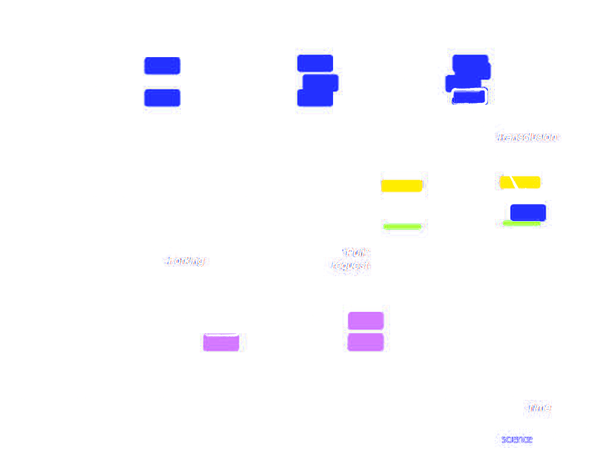
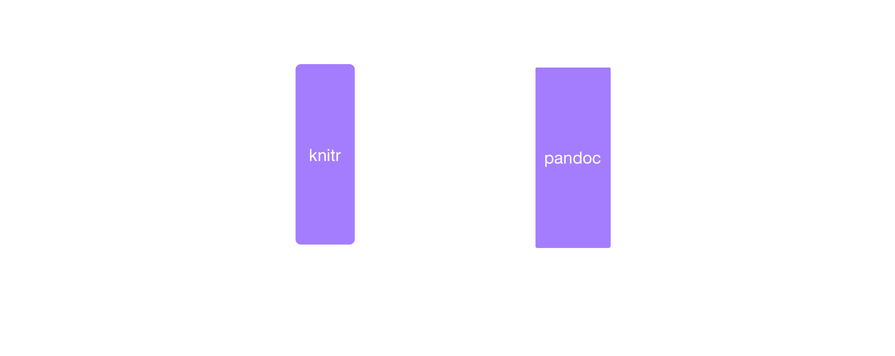
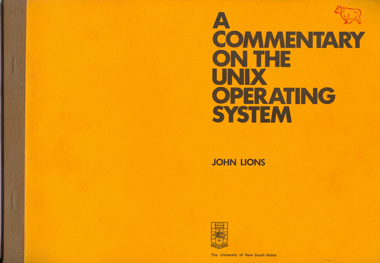
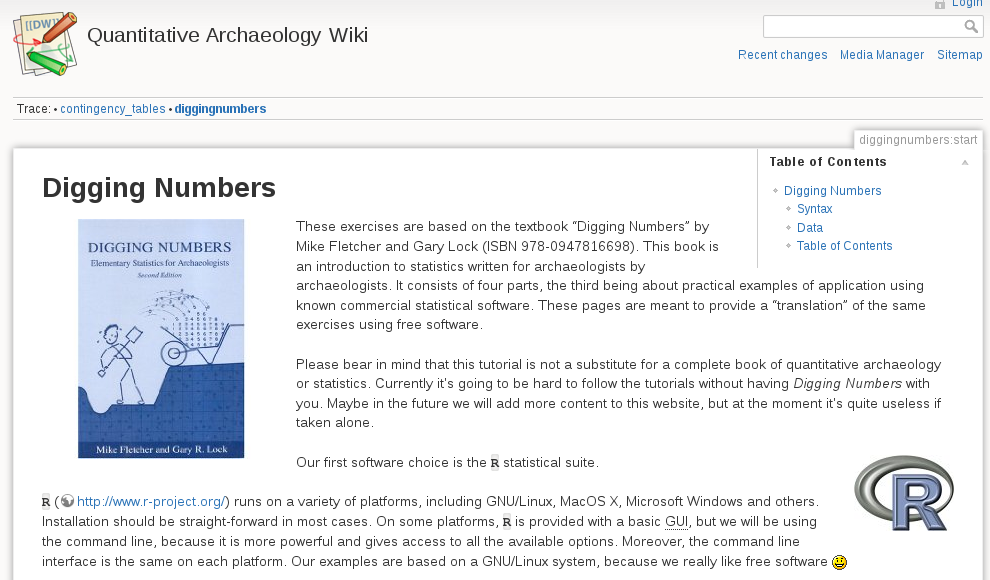

---
output:
  html_document:
    title: "Archaeological Science as Community Entreprise"
    toc: yes
---

# Abstract
If 10 years ago it seemed largely irrelevant and out of scope to adopt FOSS (Free Open-Source Software), the setting dramatically changed. Nowadays to address methodological and theoretical issues in archaeology, FOSS are attractive and promise access to powerful toolboxes accompanied with lifelong sustainability. 
An unexpected or unintended outgrowth of the adoption of FOSS is the interaction with FOSS Communities and the philosophy of software development. Such communities "are a global melting pot of diverse professions and skills that contribute to the progression of the goals represented by the software" (Wikipedia: The Free Encyclopaedia, s.v. "Humanitarian-FOSS"). Thus, archaeologist adopting FOSS deals with free, informal and wider communities, so-called FOSS communities. Each software or a specific package develops a community maintaining the software, providing advices, case examples, advertising and developing new tools. Looking for help, new ideas, possibilities of new tasks, reading or collaborate in the development of FOSS give access for archaeologist to others, less formal, but scientific communities. Platforms like Wikipedia or Stack Overflow challenge scientific communication and the reward principle driven by the traditional academic. This paper addresses how FOSS and FOSS-communities provide a common language and goal through which foreign disciplines are revisited. It also takes this different perspectives to look how this framework could enrich and challenge science and more specifically archaeological research.

Archaeological Science as Community Enterprise
 
# INTRODUCTION
Good morning, my name is Néhémie, I am a PhD student in Near Eastern Archaeology at the University of Strasbourg. I am working part time at the German Archaeological Institute in Istanbul. For my PhD I analyse a district from Hattusa -- the Bronze Age Capital of the Hittite in Central Anatolia, Turkey. So far for the self-promotion. 

In my talk, I am going to explore the ways FS influences the practices of reuse and mixing of knowledge in archaeology. This general frame of reference will provide the background to look closer at the impact of reproducibility, for which I will show some examples.

# MOTIVATION
First of all, some words on my motivations. Discussions with many colleagues brought to me the conclusion that FS and their benefits are not well understood. Even if FS is well established inside and outside academia, the advantages of Free software (that is the 'free' as in 'free speech', and not the 'free' as in 'free beer') are not acknowledged. As a young scientist and PhD candidate, I need to be prepared to make a strong statement to defend my opinions and the reasons why I use Free Software for my PhD. I am grateful to the organisers of this session for the opportunity to take a bigger look at this picture.

# SUMMARY
Let me briefly outline my talk. We will progress as follow: 
    - First I will introduce the notion of Scientific Community 
    - Then I will concentrate on the similarities between Scientific Community and Free Software Community
    - In a Third point I will examine the concept of reuse, modulation and reproducibility in Archaeology
    - Finally I will show 2 examples
    - Before I recap the main arguments in a conclusion

I begin my talk by briefly outlining what is a scientific community in order to stand out the similarities and the differences with FS in a second part

# Why is the scientific community so important?

## Science is cumulative 

  Science is cumulative even if is not clear how exactly scientific knowledge accumulates. In any case it is a community endeavour. Matt Might chose to represent   human knowledge as a circle in his webcomic  "what is a PhD". New knowledge (like a PhD) should extend the boundary of knowledge.   
  

<footer class="source">Image: [Matt Might](http://matt.might.net/articles/phd-school-in-pictures/)  |  CC BY-NC 2.5 </footer>

## Point of views

  In this process, the scientific community brings different points of views. This make the scientific knowledge accumulating and becoming "stable" faster. (I choose   the word "stable knowledge" to avoid "truth" in reference to the process of establishing a fact (I refer here to the work of Bruno Latour and others). Scientists from diverse backgrounds bring many points of views to resolve scientific problems, they choose to investigate different questions, or they may approach the same question in different ways.
  
## Diversity invigorates problem solving 

  A diverse community invigorates problem solving and generates new research methods, explanations, ideas and sheds new light on problems. Science benefits from practitioners with diverse beliefs, backgrounds, and values to check out the biases.

# Which are the functions served by the community

<footer class="source">Image: [Self-portrait of a Macaca Nigra](http://commons.wikimedia.org/wiki/File:Macaca_nigra_self-portrait.jpg)   |  CC0 1.0 </footer>

Quickly summarised the Scientific community serves three functions (that we can all observe in this session)

## Inspiration 

  Firstly it's a pool of inspiration: interactions encourage innovation and spark ideas about new lines of evidence, new applications, new questions, and alternate explanations. 

## Motivation

  Secondly it's a motivating force for recognition and respect from peers.
			
## Scrutiny

  Thirdly scientific community control the quality of scientific research by scrutinising the work of other. It's a system of checks and balances that assures that claims are not fraudulent

=I’d like to recapitulate on the Scientific Community. It's the communication and the open process inside the community that make it stronger. It's not the claim of a unique researcher that make science strong and reliable but true scrutiny and critics of the peers. 

After this look at scientific community, I would like to move on to FS

# FS and Free Science

Free Software shares a lot of characteristics with science: both have

 - Scrutiny and cumulative knowledge that can be seen in process like peer reviewing, open data subject to validation and replication
 - In FS there is a strong culture of credit, civility, reputation and communication

<!--  The motivations to do Science or FS is often seen to be in many aspects similar: it's a based on the reputation you earn with your work and there is in both cases an ethic to attribute the work (Kelty 2001). In this process of credit and reputation, researcher make their work available to others and researcher become  identified with their work. Citation then accredit reuse of ideas, concepts  or code. In the FS movement code is published and accredited as author or contributor when the code it's used, reused or modified. Free Software and Science are based on the same principle of cumulative knowledge, reuse, mixing and modulation. -->

BUT similarities between Free Software and Science should not hide the differences. The similarities make easier to compare both communities, to better understand them and the ways they are structured. Then, it's the dissimilarities that help better understand how they work. FS impresses  due to the size of projects, indirect cooperation with people all around the world, the way projects are developed, maintained, contested, and how ideas are exchanged. These dissimilarities challenge in return, what is taken for granted in science . 

<footer class="source">Image: [Bartling et al. 2014, Opening Science (Cover)](http://dx.doi.org/10.1007/978-3-319-00026-8)  |  CC BY-NC 3.0 </footer>  

# Modifiability

The concept of modifiability is without any doubt the most fascinating concept among the dissimilarities between Science and Free Software (Kelty 2008: 12). Books and articles have acclimatised science making with stable knowledge. The impression given by books or articles is that you have a definitive version  in your hands (Archaeologists speak mostly of "end publication" to contrast with "on going report"). But FS with practices like forking, new versioning, cloning, constant evolution of source code questions this concept. 

On top of this drawing, a representation of the current way of doing research with a stable knowledge: results are only used, when it is stable. At the bottom a prospect on how software development looks like and how science could be made. The process of sharing knowledge and reusing it is becoming more dynamic. However this poses a question: If the content does not need to be stable any more and are uses like Free Software, "how should the authority, stability and reliability of knowledge be assessed" (Kelty 2008:300)?  In this sense FS challenges the 'Power of Knowledge'.

<footer class="source">Image: [Bartling et al. 2014, Opening Science (fig. 3, 10)](http://dx.doi.org/10.1007/978-3-319-00026-8_1)  |  CC BY-NC 3.0 </footer>  

# FS Challenge the Power of Knowledge 
(I refer to the expression of C. Kelty is his book, Two Bits)

New practices of publication with the appearance of new information technologies render the knowledge more dynamic (@Vinck2014). Wikipedia is the most famous example with content that can be updated, changed, deleted, copied, forked at any time by anyone. The last 10 years have seen a complete revaluation of Wikipedia at the University. 10 years ago, as I saw it in France, it was mostly rejected as "untrustable source". For example, as I started as undergraduate, professors were more or less forbidding to use Wikipedia, but some years after the same professors explained how to use it scientifically, and some years after they started to contribute to Wikipedia. 

Wikipedia reveals how complex the system of evaluation of knowledge is. FS shows how this system of evaluation is now challenged. Even if there is a growing discussion on dynamic publication there are still few examples of workflow in academia.  However some model have been proposed, like the "Push and Publish" workflow proposed by Eric Kansa (@Kansa2014).

FS asks how authority is established and question the finality of publication. Contents in constant dynamic, the biggest strength in FS, gives the opportunity to better challenge the stability of science. Most importantly, if the focus is not only on the results (stable knowledge), then FS moves the attention to how evidences are established and focuses consequently on the workflow. 

Here is the point where, I will turn back to archaeology: I tackled about FS to see how it influenced science making, to expose precisely how FS attracts the attention not only on the results but on the 'how to'. FS is the only way to reconcile the process of making science with the results. It's with this sense in mind, that I will look at reproducibility in archaeology.

<footer class="source">Image: [Heller et al. 2014, Opening Science (fig. 5, 200)](http://dx.doi.org/10.1007/978-3-319-00026-8_13)  |  CC BY-NC 3.0 </footer>

# Reproducibility

Reproducibility allows anyone to start from the same data, check all the process in order to verify the results. In this slide I show how reproducibility is possible with the Software R using Literate Statistical Analysis. Starting with ideas and data, all the process are knitted together.  In Archaeology there is no culture of exchanging code for reproducibility until now, even if it is changing. If we turn back to the definition of science, however, reproducibility and sharing of code is even the sine qua non for science, to permit the community to scrutinise the work. I quote here Fanelli

    "We often forget that scientific knowledge is reliable not because scientists are more clever, objective or honest than other people, but because their claims are exposed to criticism and replication." [@Fanelli 2013] 

Code is necessary to critic, explore and reuse the work (scrutinise). <!-- The question I ask is: Can we go so far as to ask if, that is misconduct, not to provide (free) code? And that means to provide the code not only on request but that should be mandatory?  -->

Reproducibility is one of the key aspect that challenge science and I will now expose the benefits for Archaeology.  Besides  to  be a better practice of science and with a huge potential for empirical research, especially in Archaeology, reproducibility is important for:

  - First, pedagogy

  - Second, blurring communities borders 

<footer class="source">Image: [Kieran Healy's Homepage](http://kieranhealy.org/resources/) | Kieran Healy </footer>

# Pedagogy

First of all FS have a pedagogical aspect that you can not find with others software. 

To read the code, and more precisely to read commented code allows to learn quickly. Some says about FS 

    "In pedagogical terms, Windows is to fish as UNIX is to fishing lessons (Kelty 2008: 132)".

One of the most classical book in FS is the Lions' Commentary on UNIX 6th Edition. This a commentary of the V6 of UNIX that has been used by thousands of students to understand how UNIX works. Making Literate Programming gives the opportunity to  

    " concentrate [...] on explaining  to *human beings* what we want a computer to do" [@Knuth1984: 97].

<footer class="source">Image: [Columbia University Computing History](http://www.columbia.edu/cu/computinghistory/books/) | Frank da Cruz </footer>

The followings examples for Archaeology (- Note:) I speak mostly of R because it's one of the software I know the best:

  - David L. Carlson: An R Companion to Quantifying Archaeology by Stephen Shennan. It's a comment with code of the work of Shennan that make easier to access the knowledge of Shennan. Most importantly it allows then to modulate the code to use it quickly for your own research question

  - Quantitative Archaeology from the  wiki at "iosa.it" is based exactly on the same principles, with explanation of books and code for archaeologist and offers the possibility of reuse and modulation.

<footer class="source">Image: http://wiki.iosa.it </footer>

In Pedagogical term reproducibility is a big help to approach different knowledge, and this practice fit perfectly in DIY-workflows. In this case, availability of code  and comment make learning of statistic for archaeologists more experimental. Even if the learning curve is steep it's not a wall. FS in archaeology should be more often stressed as a paradigmatic pedagogical object. I think there is a lot of advocacy, that should be done with this line of argumentation for spreading of FS.

Now I will move to my second point on the challenge provided by FS: that is blurring borders.

# Blurring borders

<footer class="source">Image: [Néhémie Strupler](http://nehemie.github.io/CachetsHittites) </footer>

As I showed at the beginning of my talk, community is important for mixing ideas, innovation and motivation. The modularity of FS ease the blurring of academic borders in unpredictable ways. As an example, I present my work on Hittite seals (that can be accessed on Github). I started a project on seals, created a data-base and made the analysis with R. I was mainly working on multivariate analysis. I presented my work during an R Conference in Lyon 2013 and I earn a lot of feedback. It is in this sense, that the using of FS pushes to communicate with informal and wider communities. FS and FS-communities provide a common language and a common goal through which foreign disciplines are revisited. 
Eventually, the dataset, the code and my questions served for Bachelor thesis in statistical modelling (from Helene Lombard and Lise Radoszycki). Then, They send me the results with the code and we are now contributing to transform our work into an on-line repository (work is on-going).  This example shows that borders are not just blurred in one way (that is archaeologists need statisticians) but in the other way around too (Statisticians gain at looking data throw the eyes of archaeologists)

Reproducibility, that is, the exposing of the process with the results, transform the possibility of modulation of knowledge. By providing a common language, FS creates new transversal communities that makes science stronger.

# Conclusion

In this presentation I wanted to explore the relation of FS with archaeology. It's a first try for me to give a bigger picture and it is mainly based on my own practice. I hope to have been able to show some of the effects of FS in Science and Archaeology and the perspectives that are now open. FS challenge the authority of science and provide a mean to transform archaeology by questioning transmission and reuse of knowledge. Reproducibility makes all the research pipeline available to the scrutiny of the community by reconciling data, process and results. Finally I would like to stress our responsibility to make further advocacy of FS in archaeology, and to make it louder of this three points: 
 - FS makes science stronger
 - It is a pedagogical object
 - It encourages innovation 

Thank you very much for listening.  I would now like to give you the opportunity to ask questions.