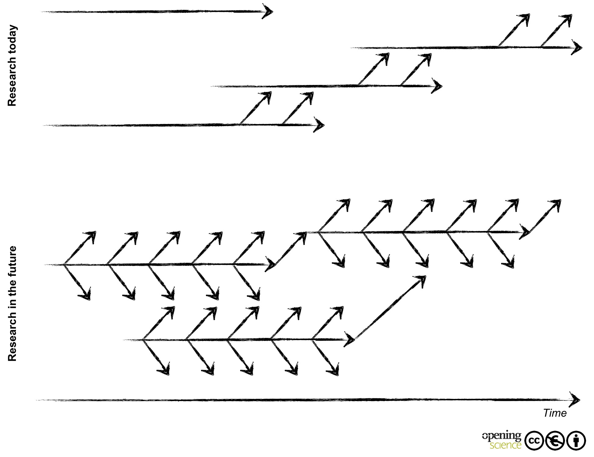
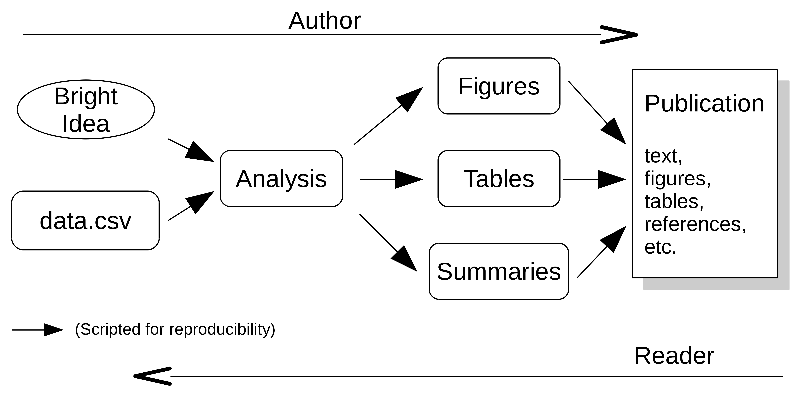

--
title: "Archaeology as Community Enterprise"
output:
  html_document:
    toc: yes
bibliography: bibliography.bib
csl: harvard-european-archaeology.csl
---

# Abstract
Computational (and quantitative) archaeology is commonly used to address methodological and theoretical issues in archaeology. However little discourse is devoted to the software that is used to perform the analysis, manipulate data or to how the software workflow should be available. This paper addresses the pressing need to adopt Free Software now when data is becoming easily available online, and tools to make reproducible research are becoming widespread. This configuration challenges current ways of publishing quantitative research.

# Introduction[^PaperOrigin]
The Open Access movement generates plenty of sympathy among archaeologists. Academia.edu has grown to one of the biggest repositories for 'freely' available archaeological papers, cross-cutting the boundaries of traditional reading circles[^Academia]. Everyone can understand the benefits of this ready availability of papers. On the other hand, the Free Software movement, where the origin of the Open Access movement is to be situated, is [mostly ignored since it is] not considered as relevant. However, on-going and growing debates about benefits of [*what does dynamism mean here?->>]dynamism in publication available through new information technologies challenge this position. Why, though, should archaeologists become more aware of the philosophy of Free Software?

Even if Free Software is well established inside and outside academia, the advantages of Free software (that is "the 'free' as in 'free speech', and not the 'free' as in 'free beer' ") are rarely acknowledged[^FreeBeer]. Free software is in many cases (in the imaginary) [assumed to be/understood as] complicated, untrustable or not as effective as ['industry-standard'] proprietary software. More generally software is treated as a [neutral] tool to answer research questions, and emphasis is placed on the results with little time devoted to the reuse of either work-flows or of the collected data.

The aim of this paper is to give a brief overview of the intersection of Free Software with Computational Archaeology. This closer look draws our attention to changes in information technologies that question [orthodox models of] knowledge dissemination. Open Access is important not only to enable access for a much wider audience to research outcomes, but it falls on us to make the access to the data and the analysis in both transparent and reproducible ways, ideals which are closer to the ethics of scientific research. This will create a stronger research environment [into the future]. 

# Earlier Work
The paper of Benjamin Ducke is, to my knowledge, the only published article discussing the relation of Free (and Open Source) Software and Archaeology [@Ducke2012]. He focusses attention on the problem of 'black boxes' [@Morin2012] and of sustainability for the development of archaeological software. [I think you need to explain what a 'black box' is here... I know what you/BD means by it, but not sure everyone (even CAA readers) would know] Proprietary software restricts the review? of methods, control over the [algorithms?/processes] and hinders the dissemination of the analysis. All those without a license to use specific proprietary software are *de facto* excluded from the reproduction of the analysis. As he acknowledges, Ducke does not examine the philosophical or social aspects of Free Software. In the analysis here, I would like to focus more narrowly on these aspects and how access to data questions methods established in archaeological research. 

# Scientific community

[Modern] science is cumulative even though it is often obscure how exactly scientific knowledge accumulates. In any case it is a community endeavour. In this process, members of the scientific community contribute different points of views, different questions and different methods to resolve same problems. The community is a pool of inspiration: interactions encourage innovation and spark ideas about new lines of evidence, new applications, new questions, and alternate explanations. Lively interactions of the scientific community allow scientific knowledge to accumulate and become "stable" faster[^StableKnowledge].  [<--- stable = orthodoxy???]

The scientific community also creates a motivating force for recognition and respect from peers (=academic prestige) and institutes controls over the quality of scientific research by scrutinising the work of others [(e.g. peer-review in journals)]. Both represent a system of checks and balances that assures that claims are not fraudulent. The communication and the open process inside the community make claims more robust [or contrarily, allow the rejection of weak claims]. Indeed it is not the work of a lone researcher that makes science strong and reliable, but true scrutiny and critics of peers [@Fanelli2013].

# Free Software and Science

Free Software shares a lot of characteristics with science. Both have scrutiny and cumulative knowledge, which can be seen in process like peer reviewing, open data subject to validation and replication. There is a strong culture of credit, civility, reputation and communication.

The motivations to do Science or Free Software are in many aspects similar: it's based on the reputation earned with published work and there is in both cases an ethic to attribute the work [@Kelty2001]. Researchers make their work available to others and citations accredit reuse of ideas, concepts or code. In Free Software or in Science, differences are made according to the status of the contribution (author, contributor, maintainer, etc.). Contributions are based on same principles of cumulative knowledge, its reuse, mixing and modulation.

But similarities between Free Software and Science should not hide differences. Dissimilarities, specifically Free Software's assets challenge what is taken for granted in Science.

# Modifiability

The concept of modifiability is without any doubt the most fascinating concept among the dissimilarities between Science and Free Software [@Kelty2008: 12]. Books and articles have [don't understand-->]acclimatised science making with stable knowledge. The impression often given by [*TCW: may I say:*, badly written, science] books or articles is that of a final or definitive version of science. But Free Software questions this concept with practices like forking, new versioning, cloning, constant evolution of source code. Every "newly available" operating system, even proprietary, contains older pieces of software.

<!-- Figure 1 -->

<footer class="source">[Figure1] [Open and wide communication of negative as well as positive findings. From Bartling et al. 2014, Opening Science (fig. 3, 10)](http://dx.doi.org/10.1007/978-3-319-00026-8_1)  |  CC BY-NC 3.0 </footer>  

The top of this diagram [Figure1], shows a representation of the current way of doing research with stable knowledge: results are only used, when they are stable. The bottom part represents how software development works and how science could be made to work. The process of sharing and reusing [already-created] knowledge is becoming more dynamic. However this poses a question. If the content does not need any more to be stable and it is used like Free Software, "how should the authority, stability and reliability of knowledge be assessed" [@Kelty2008: 300]?  In this sense Free Software can be said to challenge the "Power of Knowledge"[^PowerOfKnowledge].

# Free Software challenges the Power of Knowledge 

New practices of publication associated with the appearance of new information technologies render knowledge more dynamic [@Vinck2014]. Wikipedia is the most famous example: its content can be updated, changed, deleted, copied or forked at any time by anyone. The last 10 years have seen a complete revaluation of Wikipedia across the academy. Ten years ago, as I saw it in France, it was mostly rejected as "untrustable source". Now academics explain to their students how to use it scientifically.

Even if there is a growing discussion on publication of dynamic content there are still few examples of work-flows in academia.  The model proposed by Kansa and others -- *Push and Publish* -- will certainly have a bright future [@Kansa2014]. In this model, data are published on-line and may be updated, completed, corrected, cloned after the first online release. Repositories and digital archiving enable new dissemination methods.

By looking at the practice of Free Software, it is easier to ask how authority is established and question the finality of publication. Free Software focuses not only on the results (the software) but unifies operations and the possibility of control, improvement and reuse. Free Software allows computational archaeology not only to concentrate on the results but broaden the attention consequently on how results are reached. This is the only way to reconcile  the ethic of science and the establishment of (computational) facts. It is with this sense in mind that I will turn to the problem of reproducibility for computational archaeology.

# Reproducibility

Reproducibility allows anyone to start from the same data and check all the processes undertaken, in order to verify the results. The complete process, from ideas and data to the publication has been termed as a 'research pipeline' [figure 2]. In Archaeology there has been no culture of exchanging code for reproducibility until very recently[^SAA2015]. If we turn back to the definition of science, however, reproducibility and sharing of code are even *sine qua non* for science, to permit the community to scrutinise the work. It's the only way to stick with a robust exposition of facts. "We often forget that scientific knowledge is reliable not because scientists are more clever, objective or honest than other people, but because their claims are exposed to criticism and replication." [@Fanelli2013] 

<!-- Figure 2 -->

<footer class="source">[Figure2] Research Pipeline (after ideas from Roger Peng and Kieran Healy)  | N. Strupler  CC BY-NC 4.0 </footer>  

For computational research, best practices permit to knit together data, code, and results through scripting [@Marwick2015]. Reproducibility must be attained to adhere to the ethic of science. Moreover reproducibility has a huge potential for empirical research, like archaeology. Reproducibility is important in order to reuse and maintain data up to date. If, as shown in the *Published and Push* model, data are updated, then the analysis can be quickly updated, and therefore results do not need to remain fossilised in the (outdated) state they were published.

Reproducibility helps to cast research into modules. Bits of research based on code can be transformed and reused for similar projects or built upon for new projects. The modularity of code impacts on two levels. Firstly, open and reproducible archaeology makes resources easy available as paradigmatic pedagogical object. Hands-on workshops, modulations of research, testing of new hypothesis can be done in teaching environments with a direct, **do it yourself** approach. Secondly, the modularity of Free Software eases the blurring of academic borders in unpredictable ways. By providing a common language, Free Software creates new transversal communities that make science stronger. 

# Conclusion

Free Software challenges the authority of science and provides a mean to transform computational archaeology [and, indeed, the practice of archaeological research as a whole] by questioning transmission and reuse of research. Free Software coupled with reproducibility by means of scripting makes the entire research pipeline available to the scrutiny of the community and reconciles data, processes and results. Making the complete research available [for free online] has the potential to change computational archaeology into a more open and robust research environment.

<!-- Footnotes -->

[^PaperOrigin]: This paper is a revised version of a talk given during the session 10A "ArcheoFOSS: free/open source software and archaeological research, ten years later" at the [CAA 2015 conference "KEEP THE REVOLUTION GOING"](http://caaconference.org/). I am grateful to the organisers and to the participants for the comments in a nice and motivating atmosphere. The original paper, the slide-show and extra material are accessible online. DOI: [10.5281/zenodo.16596](http://dx.doi.org/10.5281/zenodo.16596). A video of that lecture was recorded by Doug Rocks-Macqueen and has been published under his project *Recording Archaeology*.

[^Academia]: [academia.edu](http://academia.edu) is 'free to use' but it is not free. There is no API, which would have enabled a query of the growth of papers tagged with #Archaeology during the last years and consequently asserts the affirmation from the main text. For now, it is just a guess ...

[^FreeBeer]: See the definition of the [Free Software Foundation](https://fsf.org)

[^StableKnowledge]: "Stable knowledge" refers to the process of establishing a fact, among others @Latour1979.

[^PowerOfKnowledge]: I refer to the expression of C. Kelty in his book, Two Bits [-@Kelty2008]

[^SAA2015]: For example, see the meeting during the SAA 2015 in San Francisco, "Electronic Symposium Open Methods in Archaeology: How to Encourage Reproducible Research as the Default Practice?" organised by Ben Marwick, Mark Lake and Andrew Bevan. 

---
nocite: | 
  @Heller2014
...

# References
