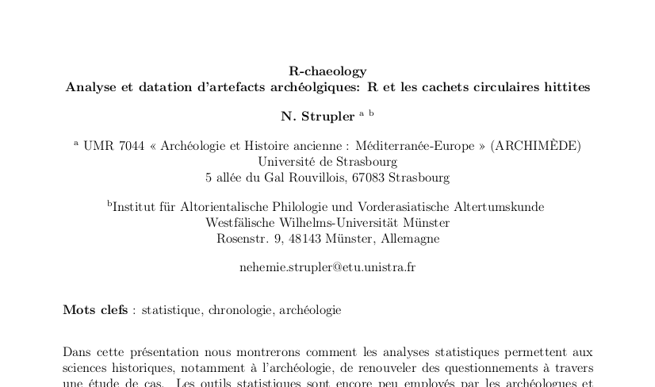

# Outline

## 
  - Scientific Community 
  - Similiraties with FS Community
  - Concepts of Reuse, Modulation and Reproducibtily
  - 2 examples
  - Conlcusion

# The scientific community

## Diversity makes the difference

  - Science is cumulative
  - Point of views
  - Diversity invigorates problem solving

<footer class="source">Image: Matt Might  |  CC BY-NC 2.5 </footer>

## Functions of the scientific community 

  - Inspiration
  - Motivation
  - Scrutiny

<footer class="source">Image: Selfy of Macaca Nigra   |  CC 0 </footer>

# FS and Free Science

## Some similarities
  - Peer review, open data subject to validation replication
  - Culture of credit, civility
  - Reputation 
  - Communication

## Modifiability
  - Century of acclimatization to stable knowledge
  - FS are in constant modulation

## Chalenge the Power of Knowledge 
<!-- [@Kelty2008] -->

  - New information technologies render the knowledge more dynamic[@Vinck2014]
  - New practices: "Push and Publish" workflow [@Kansa2014]
  - Open question of finallity

<footer class="source">Image: Heller et al. 2014 in Opening Science (fig. 5, 200)  |  CC BY-NC 3.0 </footer>

# Reproducibility

## Reuse and Reproducibility

 - « We often forget that scientific knowledge is reliable not because scientists are more clever, objective or honest than other people, but because their claims are exposed to criticism and replication.» [@Fanelli 2013] 

<footer class="source">Image: Kieran Healy </footer>

# Reproducibility

## Pedagogy

#### In pedagogical terms, Windows is to fish as UNIX is to fishing lessons. (132)

 - The Classic example is Lions' Commentary on UNIX 6th Edition, 
 - David L. Carlson -> An R Companion to Quantifying Archaeology by Stephen Shennan. It's making the Work with Shennan books much more easier.  
 - Quantitative Archaeology Wiki  from isoa.it too.

## Blurring the border

 - R Conf -> Archaeology
 - Archeology -> Stat
 - Stat to Archaeology

<footer class="source">Image: 2e Rencontres R à Lyon 2013 </footer>

<footer class="source"> Lombard Hélène et Radoszycki Lise  </footer>

<footer class="source">Image: nehemie.github.io/CachetsHittites  |  CC BY 4.0 </footer>

# The Conclusion

## Key points

 - effect of FS in Science and the perspective it opens. 
 - Need for further advocacy for FS in archaeology and I would like to see more debates on 
 - how FS challenge Knowledge transmission: open question 
 
## Colophon

Presentation written in [Markdown](http://daringfireball.net/projects/markdown/) ([R Presentation](http://www.rstudio.com/ide/docs/presentations/overview))

Compiled into HTML5 using [RStudio](http://www.rstudio.com/ide/)

Source code hosting: [https://github.com/nehemie/Slideshow](https://github.com/nehemie/Slideshow)

ORCID: [http://orcid.org/0000-0002-2898-6217](ORCID: http://orcid.org/0000-0002-2898-6217)

### Licensing:

Presentation: [CC-BY-4.0 ](http://creativecommons.org/licenses/by/4.0/)

Source code: [MIT](http://opensource.org/licenses/MIT) 

## Publishing and Pushing

<footer class="source">Kansa, E. C.; Kansa, S. W. & Arbuckle, B. Publishing and Pushing: Mixing Models for Communicating Research Data in Archaeology,  *International Journal of Digital Curation*, 2014, 9.1, 57-70 </footer>
