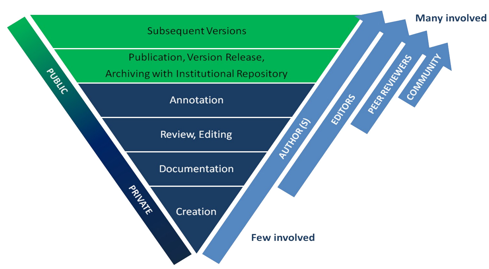

# Outline

## 
  - Scientific Community 
  - Parallel of Scientific Community with FOSS Community
  - Concepts of Reuse, Modulation and Reproducibtily
  - 3 examples
  - Conlcusion

# The scientific community

## Diversity makes the difference

  - Science is cumulative
  - Point of views
  - Diversity invigorates problem solving. 

## Functions 

  - Inspiration
  - Motivation.
  - Scrutiny. 

# FOSS and Free Science

## Some parallels
  - Peer review, open data subject to validation replication
  - Culture of credit, civility
  - Reputation. 
  - Communication

"the circumstance that the more widely scientists make their intellectual property available to others, the more securely it becomes identified as their property. For science is public not private knowledge. [...] For the claim resides only in the recognition of the source of the contribution by peers" [@Garfield1979]

## Chalenge the Power of Knowledge [@Kelty2008]

  - FOSS chalenge Science: Finality of knowledge
  - Information Technologies render the Knowledge more dynamic
  - New practices: "Push and Publish" workflow [@Kansa2014]
  - Culture of sharing and Reproducibility

# Reproducibility

## Reuse and Reproducibility

  - Sharing and reuse is mandatory in FOSS
  - Currently applicable in Science
  - Establishing in Archaeology

# Rerproducibility Challenges

## Pedagogy. 

### In pedagogical terms, Windows is to fish as UNIX is to fishing lessons. (132)

 - The Classic example is Lions' Commentary on UNIX 6th Edition, 
 - David L. Carlson -> An R Companion to Quantifying Archaeology by Stephen Shennan. It's making the Work with Shennan books much more easier.  
 - Quantitative Archaeology Wiki  from isoa.it too.

## Blurring the border

 - R Conf -> Archaeology
 - Archeology -> Stat
 - Stat to Archaeology
 
## Modulation 
Modulations happen whenever someone learns how some component of Free Software works and asks, “Can I try these practices out in some other domain?” (Kelty 2008: 16)

# The Conclusion

## Key points

 - effect of FS in Science and the perspective it oppens. 
 - Need for further advocacy for FS in archaeology and I would like to see more debates on 
 - how FS challenge Knowledge transmission: open question 
 
## Colophon

Presentation written in [Markdown](http://daringfireball.net/projects/markdown/) ([R Presentation](http://www.rstudio.com/ide/docs/presentations/overview))

Compiled into HTML5 using [RStudio](http://www.rstudio.com/ide/)

Source code hosting: [https://github.com/nehemie/Slideshow](https://github.com/nehemie/Slideshow)

ORCID: [http://orcid.org/0000-0002-2898-6217](ORCID: http://orcid.org/0000-0002-2898-6217)

### Licensing:

Presentation: [CC-BY-4.0 ](http://creativecommons.org/licenses/by/4.0/)

Source code: [MIT](http://opensource.org/licenses/MIT) 

## Publishing and Pushing

<footer class="source">Kansa, E. C.; Kansa, S. W. & Arbuckle, B. Publishing and Pushing: Mixing Models for Communicating Research Data in Archaeology,  *International Journal of Digital Curation*, 2014, 9.1, 57-70 </footer>
