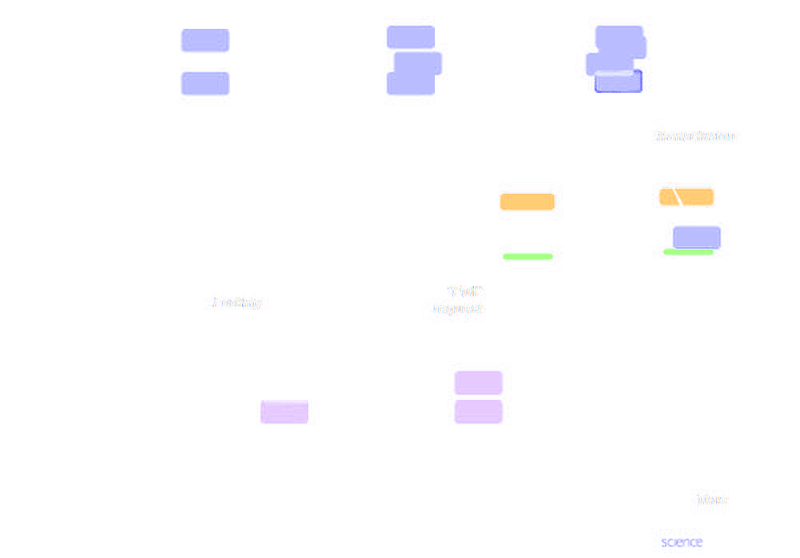
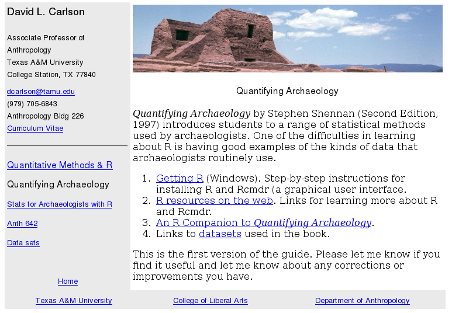
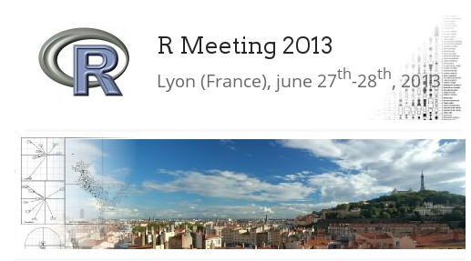
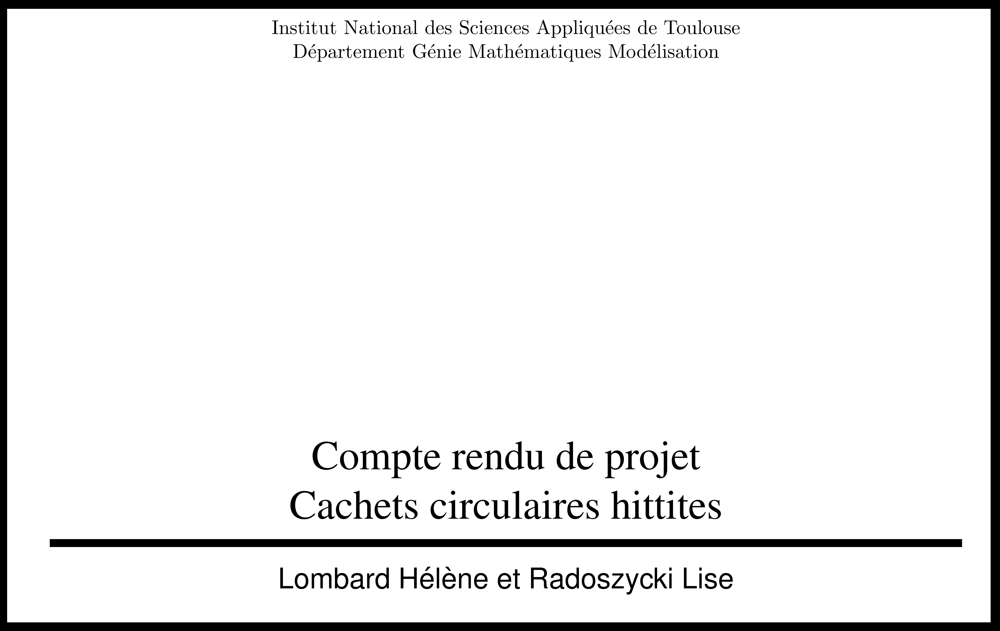
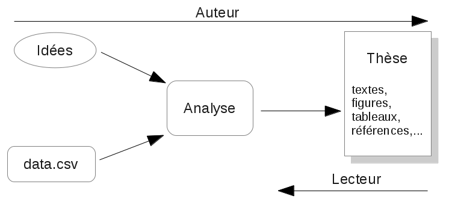
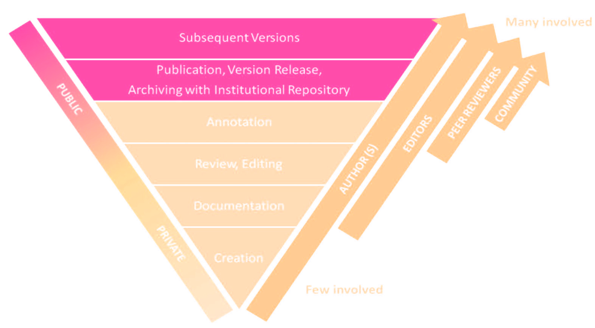

# Outline

## Outline {.flexbox .vcenter}

  - What is a Scientific Community 
  - Similarities with FS Community
  - Concepts of Reuse, Modulation and Reproducibility
  - Reproducibility in Archaeology
  - Conclusion

# The scientific community

## Diversity makes the difference

  - Science is cumulative
  - Differents points of views stabilise knowledge
  - Diversity invigorates problem solving

<footer class="source">Image: [Matt Might](http://matt.might.net/articles/phd-school-in-pictures/)  |  CC BY-NC 2.5 </footer>

## Functions of the scientific community

 

  - Inspiration
  - Motivation
  - Scrutiny

<footer class="source">Image: [Self-portrait of a Macaca Nigra](http://commons.wikimedia.org/wiki/File:Macaca_nigra_self-portrait.jpg)   |  CC0 1.0 </footer>

# Free Software and Science

## Some similarities

  - Peer review
  - Validation and replication
  - Culture of credit, civility
  - Reputation 
  - Communication
  

<footer class="source">Image: [Bartling et al. 2014, Opening Science (Cover)](http://dx.doi.org/10.1007/978-3-319-00026-8)  |  CC BY-NC 3.0 </footer>  

### Some dissimilarities

 - How project are developed, maintained, contested, and how ideas are exchanged
 - Challenge what is taken for granted in science

## Modifiability
  - Centuries of accomodation to 'stable knowledge'
  - New paradigms with constant modulation
  

<footer class="source">Image: [Bartling et al. 2014, Opening Science (fig. 3, 10)](http://dx.doi.org/10.1007/978-3-319-00026-8_1)  |  CC BY-NC 3.0 </footer>  

## Chalenge the ‘Power of Knowledge’ | C. Kelty, Two Bits

  - New IT render the knowledge more dynamic (Vinck 2014)
  - New practices: "Push and Publish" workflow (Kansa 2014)
  - Reconcile process and result

<footer class="source">Image: [Heller et al. 2014, Opening Science (fig. 5, 200)](http://dx.doi.org/10.1007/978-3-319-00026-8_13)  |  CC BY-NC 3.0 </footer>

# Reproducibility

## Reproducibility (Cf. Ben Marwick) {.build .flexbox .vcenter}

<footer class="source">Image: [Kieran Healy's Homepage](http://kieranhealy.org/resources/) | Kieran Healy </footer>

"We often forget that scientific knowledge is reliable not because scientists are more clever, objective or honest than other people, but because their claims are exposed to criticism and replication." [@Fanelli2013] 

## Pedagogical role {.build}

" In pedagogical terms, Windows is to fish as UNIX is to fishing lessons "

 - Lions' Commentary on UNIX 6th Edition

<footer class="source">Image: [Columbia University Computing History](http://www.columbia.edu/cu/computinghistory/books/) | Frank da Cruz </footer>

## Pedagogy

" In pedagogical terms, Windows is to fish as UNIX is to fishing lessons "

> - Lions' Commentary on UNIX 6th Edition
> - An R Companion to Quantifying Archaeology by Stephen Shennan from David L. Carlson

<footer class="source">Image: [David L. Carlson's Website](http://people.tamu.edu/~dcarlson) </footer>

## Pedagogy

" In pedagogical terms, Windows is to fish as UNIX is to fishing lessons " 

> - Lions' Commentary on UNIX 6th Edition
> - An R Companion to Quantifying Archaeology by Stephen Shennan from David L. Carlson
> - Quantitative Archaeology Wiki

<footer class="source">Image: http://wiki.iosa.it </footer>

## Blurring the borders {.build}

 - (Archaeological) project with R on Hittite seals 

<footer class="source">Image: [2nd R Meeting, Lyon (France), june 27th-28th, 2013](http://r2013-lyon.sciencesconf.org/) </footer>

## Blurring the borders

> - (Archaeological) project with R on Hittite seals 
> - Turn into statistic question

<footer class="source"> Lombard Hélène et Radoszycki Lise  </footer>

## Blurring the borders: ‘Ambiguate’

> - (Archaeological) project with R on Hittite seals 
> - Turn into statistic question
> - Mixing of competences

<footer class="source">Image: [Néhémie Strupler](http://nehemie.github.io/CachetsHittites)  |  CC BY 4.0 </footer>

# Conclusion

## Key points

 - effect of FS in Science 
 - new perspective
 - need for further advocacy for FS
 - Open question: how far FS challenge knowledge transmission?  
 
## Colophon

Presentation written in [Markdown](http://daringfireball.net/projects/markdown/) ([ioslides](http://rmarkdown.rstudio.com/ioslides_presentation_format.html))

Compiled into HTML5 using [RStudio](http://www.rstudio.com/ide/)

Source code hosting: [https://github.com/nehemie/caa2015](https://github.com/nehemie/caa2015)

ORCID: [http://orcid.org/0000-0002-2898-6217](ORCID: http://orcid.org/0000-0002-2898-6217)

### Licensing:

Presentation: [CC BY 4.0 ](http://creativecommons.org/licenses/by/4.0/)

Source code: [MIT](http://opensource.org/licenses/MIT) 

## Backup slide | Publishing and Pushing

<footer class="source">Kansa, E. C.; Kansa, S. W. & Arbuckle, B. Publishing and Pushing: Mixing Models for Communicating Research Data in Archaeology,  *International Journal of Digital Curation*, 2014, 9.1, 57-70 </footer>

---
nocite: | 
  @Kelty2001, @Kelty2008, @Kansa2014, @Vinck2014
...

## References {.smaller}
